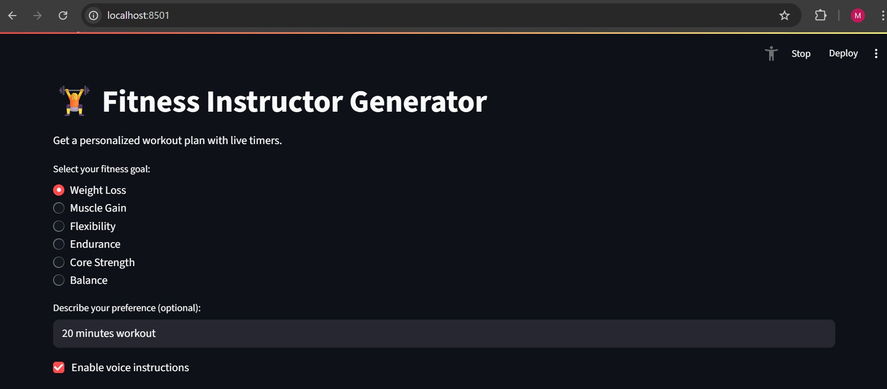
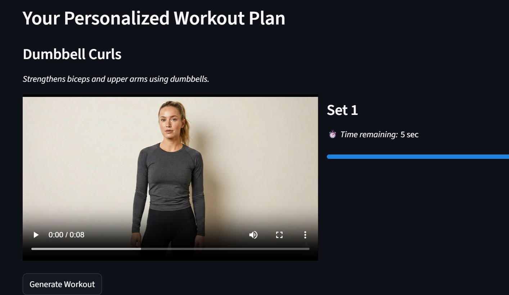

# 🏋️ Fitness Instructor Generator

A Streamlit web app that generates personalised workout plans with live timers, exercise videos, and optional voice instructions — powered by an NLP pipeline and a scikit-learn ML model.

---

## 📸 Screenshots

**Goal selection & preference input**


**Live workout with video demo and countdown timer**


---

## ✨ Features

| Feature | Detail |
|---|---|
| **Goal-based workouts** | Weight Loss · Muscle Gain · Flexibility · Endurance · Core Strength · Balance |
| **NLP intent classifier** | Keyword-based intent detection with text preprocessing (NLTK) |
| **ML goal prediction** | LinearSVC trained on TF-IDF char n-grams; auto-retrained when data changes |
| **TF-IDF exercise ranking** | Cosine similarity re-ranks exercises to best match free-text preference |
| **Live timers & progress bars** | Per-set countdown with visual progress |
| **Exercise videos** | MP4 demonstrations play during each set |
| **Voice instructions** | Optional TTS via `pyttsx3` announces each exercise |

---

## 🗂️ Project Structure

```
fitness_instructor_generator/
├── app.py                        # Streamlit entry point
├── requirements.txt
├── .gitignore
│
├── assets/                       # Exercise demo videos (.mp4)
│
├── data/
│   └── training_data.csv         # Labelled training examples for ML model
│
├── nlp/
│   ├── __init__.py
│   ├── exercise_metadata.py      # Single source of truth for all exercises
│   ├── intent_classifier.py      # Keyword-based intent classifier
│   ├── entity_extractor.py       # Extracts goal, level, equipment from text
│   ├── preprocess.py             # Tokenisation, stopword removal, lemmatisation
│   ├── ml_intent_model.py        # Train / evaluate / predict with LinearSVC
│   └── ml_helper.py              # ML + keyword fallback wrapper
│
├── workout_engine/
│   ├── __init__.py
│   └── generator.py              # Filters & ranks exercises, returns top 3
│
├── audio/
│   ├── __init__.py
│   └── tts.py                    # pyttsx3 text-to-speech helper
│
└── docs/
    ├── pipeline.md               # NLP pipeline overview
    └── screenshots/              # App screenshots for README
```

> **Note:** `nlp/ml_goal_model.pkl` is auto-generated at runtime and excluded from version control via `.gitignore`. It is rebuilt automatically from `data/training_data.csv` on first run.

---

## 🚀 Quick Start

### 1 — Clone the repo

```bash
git clone https://github.com/<your-username>/fitness-instructor-generator.git
cd fitness-instructor-generator
```

### 2 — Create a virtual environment

```bash
python -m venv venv
source venv/bin/activate      # Windows: venv\Scripts\activate
```

### 3 — Install dependencies

```bash
pip install -r requirements.txt
```

### 4 — Download NLTK data (one-time)

```bash
python -c "import nltk; nltk.download('stopwords'); nltk.download('wordnet')"
```

### 5 — Run the app

```bash
streamlit run app.py
```

Open **http://localhost:8501** in your browser.

---

## 🎬 Video Assets

Exercise demo videos are stored in `assets/`. If you clone the repo without Git LFS, the `.mp4` files may download as pointer stubs. To pull the actual video files:

```bash
git lfs install
git lfs pull
```

Alternatively, drop your own `.mp4` files into the `assets/` folder — the app will play any file matching a key in the `EXERCISE_VIDEOS` dict in `app.py`.

---

## 🧠 How It Works

```
User input (text)
      │
      ▼
 preprocess.py          ← lowercase · remove punctuation · lemmatise
      │
      ├──▶ intent_classifier.py   ← keyword matching → intent label
      │
      └──▶ ml_helper.py           ← LinearSVC prediction → goal label
                                     (keyword fallback if ML fails)
                                            │
                                            ▼
                                   generator.py
                                   · filter EXERCISES by goal
                                   · TF-IDF cosine re-rank (if text given)
                                   · return top 3 exercises
                                            │
                                            ▼
                                   app.py (Streamlit UI)
                                   · video · timer · voice
```

---

## 🤖 ML Model

The goal classifier lives in `nlp/ml_intent_model.py`.

**Training data:** `data/training_data.csv`
```
text,label
lose weight quickly,weight_loss
build muscle size,muscle_gain
...
```

**To evaluate model variants with cross-validation:**

```bash
python nlp/ml_intent_model.py --evaluate
```

Example output:
```
LinearSVC(word_1_2): accuracy=0.917 (+/-0.042)
LinearSVC(char_3_5): accuracy=0.933 (+/-0.038)
LogReg(word_1_2):    accuracy=0.900 (+/-0.051)
```

**To add more training data**, append rows to `data/training_data.csv` — the model retrains automatically on the next app run.

---

## ⚙️ Configuration

| Constant | File | Default | Description |
|---|---|---|---|
| `VOICE_DELAY_SECONDS` | `app.py` | `2` | Pause after TTS announcement |
| `BEST_VECTORIZER_KWARGS` | `ml_intent_model.py` | char n-grams (3–5) | TF-IDF settings for the model |

---

## 📦 Dependencies

| Package | Purpose |
|---|---|
| `streamlit` | Web UI framework |
| `scikit-learn` | TF-IDF vectoriser, LinearSVC, cosine similarity |
| `nltk` | Stopwords, WordNet lemmatiser |
| `pyttsx3` | Offline text-to-speech |

---

## 🤝 Contributing

1. Fork the repo
2. Create a feature branch: `git checkout -b feature/your-feature`
3. Commit your changes: `git commit -m "feat: describe your change"`
4. Push the branch: `git push origin feature/your-feature`
5. Open a Pull Request

To add a new exercise, edit `nlp/exercise_metadata.py` and drop the demo `.mp4` in `assets/`.

---

## 📄 Licence

MIT — see [LICENSE](LICENSE) for details.
